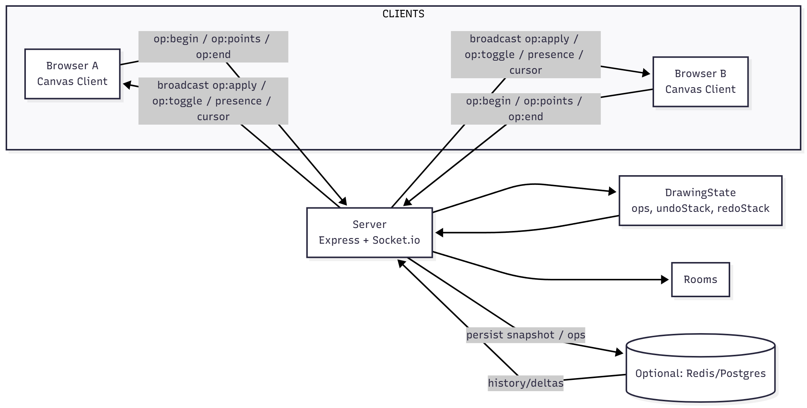
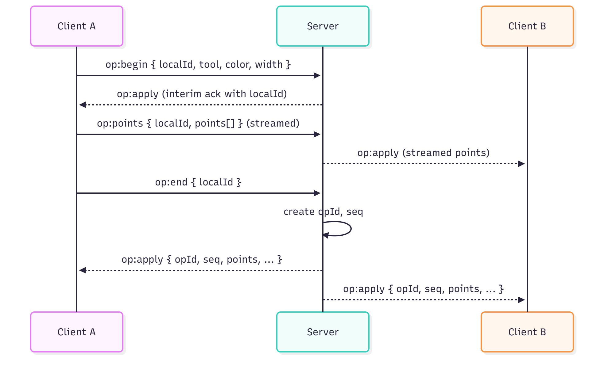
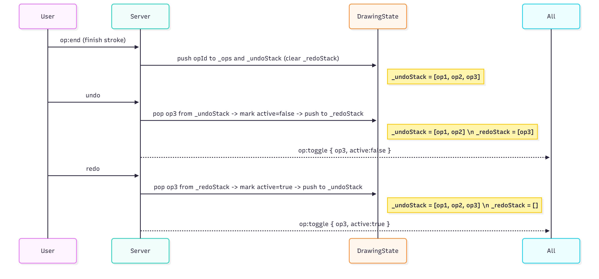

# 🏗️ Real-Time Collaborative Drawing Canvas — Architecture Overview

This document explains the system architecture, data flow, and synchronization logic behind the **Real-Time Collaborative Drawing Canvas** project.  
It highlights how drawing events flow between clients and the server, how undo/redo is globally synchronized, and the optimizations used to ensure smooth, low-latency performance.

---

## **1️⃣ Data Flow Diagram**

This diagram shows how drawing events move between clients and the Node.js WebSocket server.  
Each user’s actions are serialized into events (`begin`, `points`, `end`) and synchronized in real time.



### **Flow Description**
1. **Client (Browser)** captures drawing events on the HTML5 canvas.
2. Events are sent to the server using WebSockets.
3. The **Server (Node.js + Socket.io)** validates, timestamps, and rebroadcasts them to all clients.
4. The **DrawingState** module stores stroke history for undo/redo.
5. The **Rooms** module tracks connected users and assigns each a color.
6. All clients render strokes instantly to maintain synchronized visual state.

---

## **2️⃣ WebSocket Protocol**

The system uses **Socket.io** for full-duplex real-time communication.  
Below is the message schema for each WebSocket event.

| Event Name | Direction | Description | Example Payload |
|-------------|------------|--------------|-----------------|
| `op:begin` | Client → Server | User starts a stroke | `{ localId, tool, color, width }` |
| `op:points` | Client → Server | Sends stroke points | `{ localId, points: [[x, y], [x, y]] }` |
| `op:end` | Client → Server | Ends stroke | `{ localId }` |
| `op:apply` | Server → All | Broadcasts completed stroke | `{ opId, color, width, points, author }` |
| `op:toggle` | Server → All | Toggles active/inactive strokes (undo/redo) | `{ opId, active }` |
| `cursor` | Client ↔ Server | Tracks live cursor position | `{ x, y, userId, name, color }` |
| `presence` | Server → All | Sends list of connected users | `{ users: [{id, name, color}, ...] }` |

These events form the backbone of the real-time drawing experience.



---

## **3️⃣ Undo / Redo Strategy**

Undo and redo operations are **global**, affecting all connected users.  
This is managed by the server-side `DrawingState` class.



### **Core Concept**

The server maintains a single source of truth through three main data structures:
```js

_ops = [];          // All stroke operations  
_undoStack = [];    // Stack of active operations  
_redoStack = [];    // Stack of undone operations  

// Undo Operation  
// → Mark last active operation as inactive  
// → Broadcast { active: false } to all clients  

// Redo Operation  
// → Reactivate operation from redoStack  
// → Broadcast { active: true } to all clients  
```


### **4️⃣ Performance Optimizations**

| Optimization               | Description                                 |
| -------------------------- | ------------------------------------------- |
| Client-Side Prediction     | Immediate local rendering before server ack |
| Event Throttling           | Batches mouse/touch points                  |
| Bézier Smoothing           | Produces natural curves                     |
| Efficient Redraws          | Redraws only on Undo/Redo                   |
| In-Memory State            | Minimizes latency                           |

These choices keep rendering smooth and bandwidth low, even with many users.


### **5️⃣ Conflict Resolution**

Simultaneous strokes or erases in overlapping regions use a Last-Write-Wins (LWW) rule.
Operations carry timestamps and sequence numbers — the latest update overwrites previous ones.

Why LWW?

Simple and deterministic

Consistent across clients

Minimal overhead

Future versions may adopt CRDTs for fine-grained merging.


### **🧩 Summary Table**
| Component            | Responsibility              |
| -------------------- | --------------------------- |
| Canvas.js            | Capture and render strokes  |
| websocket.js         | Real-time event handling    |
| server.js            | Core routing + Socket.io    |
| drawing-state.js     | Manage undo/redo stacks     |
| rooms.js             | Track online users + colors |
